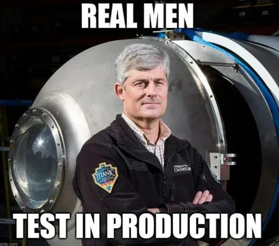

I'm a 23-year-old software engineer currently focused on TypeScript, with expertise in Nest.js and React. 

My interests (hobbies?) span various domains:
  - Playwright and data scrapping.
  - Mobile development with Flutter.
  - Machine Learning/Neural Networks.
  - Competitive programming to sharpen problem-solving skills.
  - Exploring new technologies like Go, Svelte, GraphQL.
  - Learning Spanish 😎

(I use vitest, don't worry).
<!--
**nonme/nonme** is a ✨ _special_ ✨ repository because its `README.md` (this file) appears on your GitHub profile.

Here are some ideas to get you started:

- 🔭 I’m currently working on ...
- 🌱 I’m currently learning ...
- 👯 I’m looking to collaborate on ...
- 🤔 I’m looking for help with ...
- 💬 Ask me about ...
- 📫 How to reach me: ...
- 😄 Pronouns: ...
- ⚡ Fun fact: ...
-->
